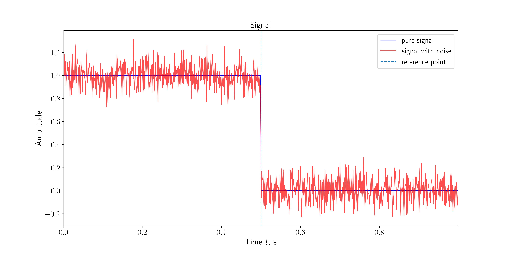
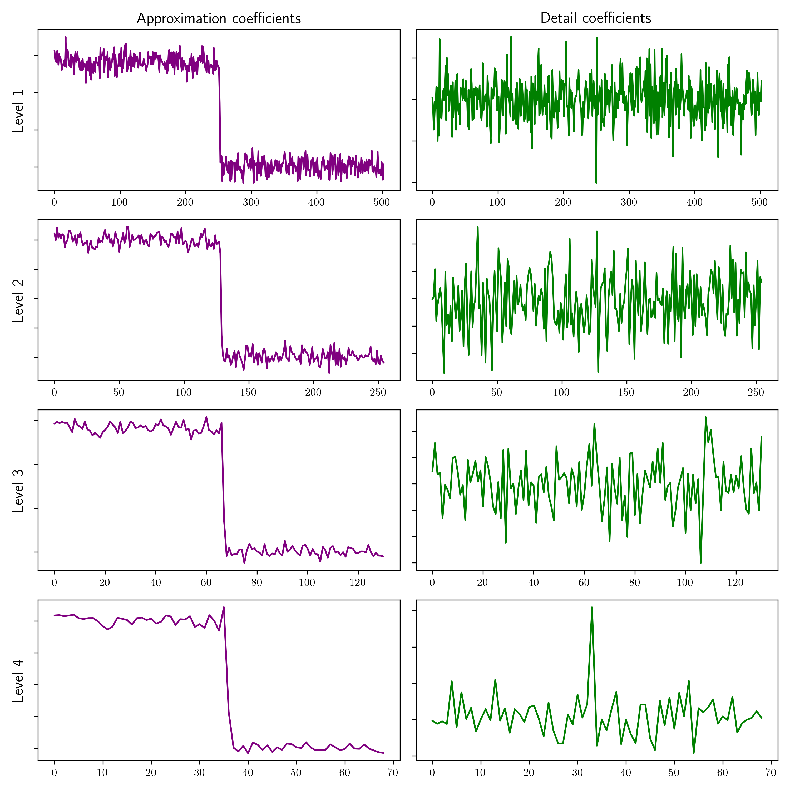
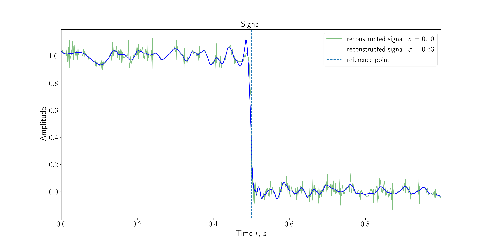
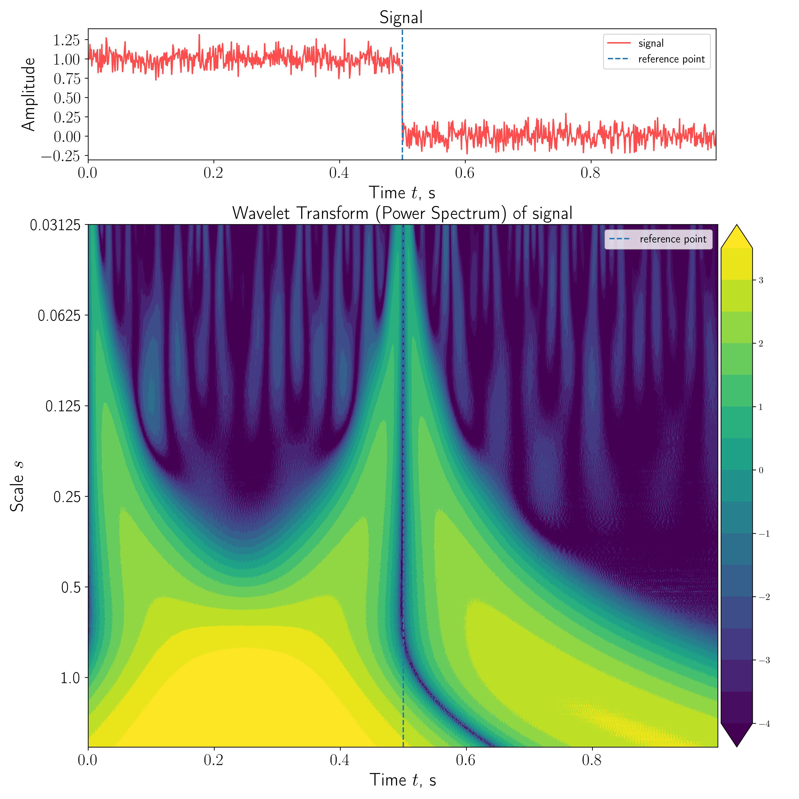
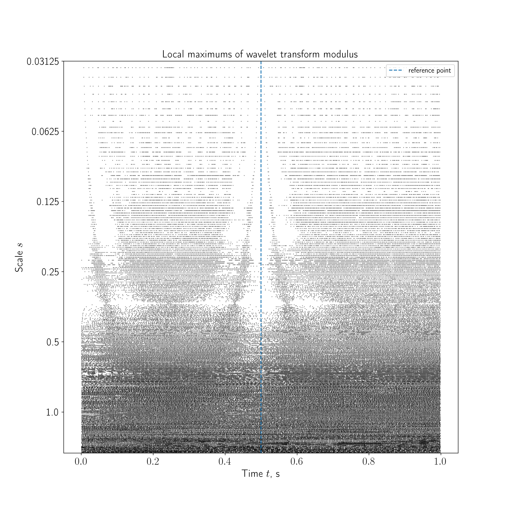

# CET-X-MIPT

В данном репозитории представлен проект, выполненный в рамках стажировки от Инжинирингового центра МФТИ по трудноизвлекаемым полезным ископаемым (отдел CET-X МФТИ).

## Применение вейвлет-анализа в задаче локализации утечек в трубопроводе

Проект посвящен изучению методик локализации утечек в трубопроводах, основанных на анализе сигналов давления. Предложенный метод **NPW** (negative pressure wave method) основан на регистрации датчиком давления в трубопроводе момента достижения отрицательной ударной волны, распространяющейся от места утечки. 

### Мотивация использования вейвлетов

NPW метод обладает очевидными преимуществами -- быстрая скорость нахождения утечки, использование минимального объема физических ресурсов, применение вычислительных ресурсов. Однако данный метод обладает некоторыми недостатками. 

1. Влияние внешнего шума на точность показаний датчика
2. Невозможность определения размера утечки
3. Ложная тревога в результате изменений нормальной работы гидравлической системы

Возможный вариант улучшения NPW-метода -- фильтрация сигнала. Для фильтрации предлагается использовать аппарат **вейвлет-преобразований**. Для поиска момента прихода ударной волны в исследуемом сигнале также предлагается использовать вейвлет-анализ.

### Содержание проекта

В первой части рассмотрен threshold-метод фильтрации сигнала давления, основанный на *удалении высокочастотного шума, амплитуда которого выше некоторого порогового значения*. Проводится исследование качества обработки сигнала и подбор оптимальных значений параметров, необходимых для эффективного восстановления основного сигнала.

Во второй части работы изучены свойства вейвлет-преобразований, которые используются при анализе сигнала давления и выделения в нем локальных особенностей. Предложено два алгоритма поиска сингулярностей в сигнале (метод *максимума модуля*, метод *gutter search*) рассмотрены их преимущества и недостатки. 

### Основные этапы в продвижении проекта

I. Первая часть

1. **Конструкция сигнала, регистрируемого датчиком**

2. **Декомпозиция сигнала**

3. **Фильтрация сигнала с помощью threshold-tecnique**

II. Вторая часть

4. **Непрерывное вейвлет-преобразование сигнала**

5. **Метод максимума модуля**

6. **Gutter search**

Для более детального изучения проекта можно обратиться к презентации проекта.

